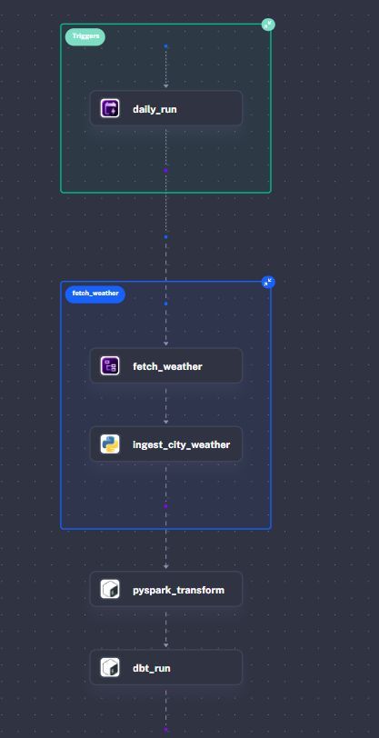
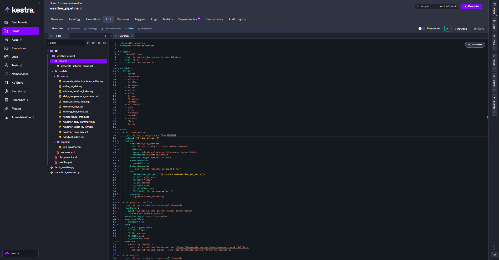
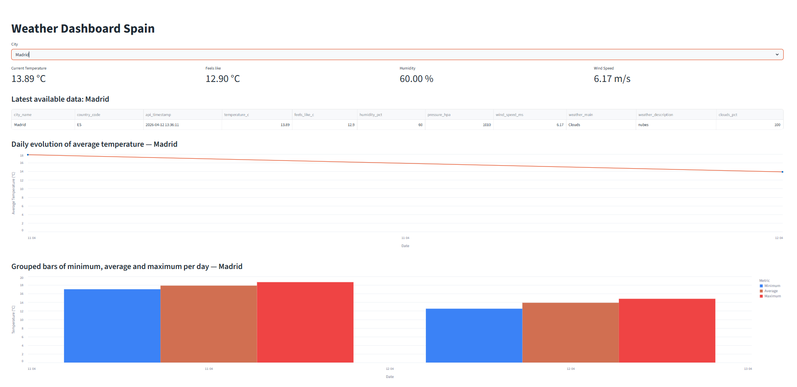
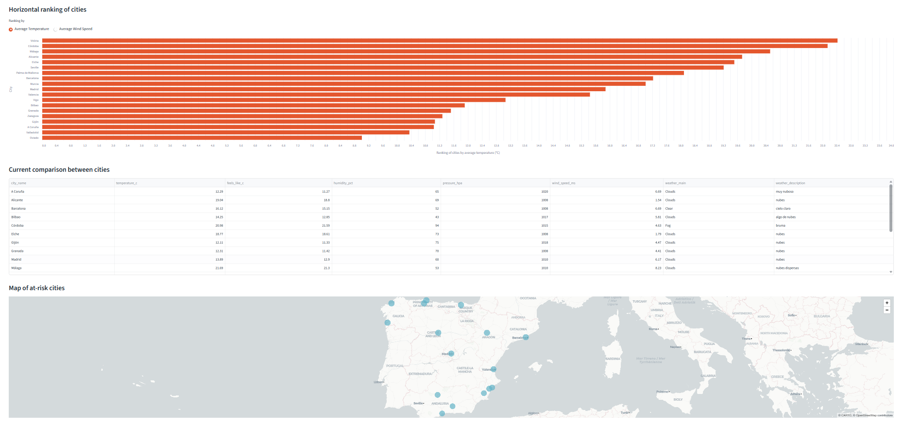

# 🌦️ Weather Data Engineering Project

## Overview

This project implements a complete **data engineering pipeline** for ingesting, transforming, and visualizing weather data. It follows modern data stack principles using **Docker, dbt, PostgreSQL, Kestra, and Streamlit**.

The pipeline is designed to simulate a production-ready workflow:

* Data ingestion from an external weather API
* Storage in a PostgreSQL database (raw layer)
* Transformation using dbt (staging + marts)
* Orchestration with Kestra
* Visualization via Streamlit dashboard

---

## Architecture

```
Weather API → PostgreSQL (raw) → dbt (staging + marts) → Streamlit Dashboard
                                ↑
                              Kestra (orchestration)
```

### Layers

* **Raw layer**: API data ingested as-is
* **Staging layer**: cleaned and standardized data
* **Marts layer**: analytical models ready for BI/dashboard

---

## Technologies Used
```
| Tool                    | Purpose                   |
| ----------------------- | ------------------------- |
| Docker & Docker Compose | Containerization          |
| PostgreSQL              | Data warehouse            |
| dbt                     | Data transformation       |
| Kestra                  | Workflow orchestration    |
| Streamlit               | Dashboard & visualization |
| Python                  | Data ingestion scripts    |
```
---

## Project Structure

```
weather/
│
├── docker-compose.yml
├── app/
│   └── streamlit_app.py
│
├── dbt/
│   └── weather_project/
│       ├── dbt_project.yml
│       ├── profiles.yml
│       ├── models/
│       │   ├── staging/
│       │   └── marts/
│       ├── macros/
│       └── logs/
│
└── .streamlit/
```

---

## 🚀 Installation & Setup

### 1. Clone the repository

```bash
git clone <your-repo-url>
cd weather
touch .env
```

Write next parameters with Base64 Codification:

Open [openweathermap](https://home.openweathermap.org/api_keys) and register to get the API Key and paste in SECRET_OPENWEATHER_API_KEY

```bash
SECRET_PG_USERNAME=
SECRET_PG_PASSWORD= 
SECRET_OPENWEATHER_API_KEY=
```
---

### 2. Start services with Docker

```bash
docker compose up -d
```

This will start:

* PostgreSQL (`pgdatabase`)
* dbt container
* Other services (Kestra if configured)

---

### 3. Verify database

PostgreSQL config:

```
Host: localhost:8085
Port: 5434
User: root
Password: root
Database: weather
```
The schemas and tables are: 

---

## dbt Configuration

### profiles.yml

The environment is configured:

* `docker` → execution inside containers

Example:

```yaml
weather_project:
  target: dev
  outputs:
    dev:
      type: postgres
      host: "{{ env_var('PG_HOST') }}"
      user: "{{ env_var('PG_USER') }}"
      password: "{{ env_var('PG_PASSWORD') }}"
      port: "{{ env_var('PG_PORT') | int }}"
      dbname: "{{ env_var('PG_DB') }}"
      schema: public
      threads: 1
```

---

##  Running dbt

```
## 📁 dbt structure
dbt/
├── dbt_packages/
├── logs/
│   └── dbt.log
└── weather_project/
    ├── dbt_project.yml
    ├── profiles.yml
    ├── logs/
    │   └── dbt.log
    ├── macros/
    │   └── generate_schema_name.sql
    └── models/
        ├── marts/
        │   ├── anomaly_detection_temp_cities.sql
        │   ├── cities_at_risk.sql
        │   ├── climate_comfort_index.sql
        │   ├── daily_temperature_variation.sql
        │   ├── days_extreme_heat.sql
        │   ├── extreme_days.sql
        │   ├── ranking_hot_cities.sql
        │   ├── temperature_trend.sql
        │   ├── weather_daily_summary.sql
        │   ├── weather_latest_by_city.sql
        │   ├── weather_type_day.sql
        │   └── windiest_cities.sql
        └── staging/
            └── stg_weather.sql
```
## Data Models

### 🔹 Staging Layer

fetch_weather.py

Data ingestion script that retrieves weather data from the OpenWeather API and stores it in PostgreSQL within the raw layer.

Performs HTTP requests to the API using an API key (OPENWEATHER_API_KEY) and a city defined via environment variables
Normalizes timestamps (UTC) and structures relevant fields from the payload
Automatically creates the raw.weather_api table if it does not exist
Inserts data along with:
ingestion_timestamp (load tracking)
full raw_payload in JSONB format (traceability and auditability)
Implements an append-only ingestion model, without overwriting existing data

Result: raw, complete, and fully traceable data ready for downstream transformations

transform_weather.py

Intermediate transformation script that processes raw data using PySpark and produces a clean and consistent dataset.

Reads data from raw.weather_api via JDBC
Removes duplicates using a window function partitioned by city_name and api_timestamp, keeping the most recent record (ingestion_timestamp)
Drops unnecessary columns (e.g., raw_payload)
Adds derived variables:
weather_date (date for time-based analysis)
Selects and standardizes relevant analytical columns
Writes the result into the int_weather_spark table using overwrite mode

Result: structured, deduplicated dataset ready for analytical consumption (dbt / marts / dashboard)

---

### 🔹 Marts Layer

Business-ready models:

* Aggregations by city
* Weather condition classification
* Risk indicators (e.g., extreme temperatures)

---
## Orchestration (Kestra)

Kestra is used to automate:

* Data ingestion
* dbt runs
* Scheduling

Typical flow:

1. Fetch API data
2. Load into PostgreSQL
3. Execute dbt models

Kestra Flow is:



And the structure is:

---

## Dashboard (Streamlit)





### Features

* Weather per city
* Temperature trends
* Risk classification (heat alerts)
* Interactive filtering

---

## Key Features

* End-to-end pipeline (ingestion → transformation → visualization)
* Modular dbt models
* Environment separation (local vs docker)
* Reproducible setup with Docker
* Orchestration-ready design

---

## Improvements & Future Work

* Add data quality tests (dbt tests)
* Implement incremental models
* Add CI/CD pipeline

---

## Author

Christian Molina - Data Engineering Zoomcamp Project 

---

## License

MIT License
